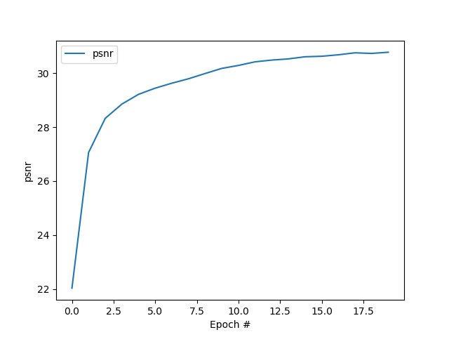
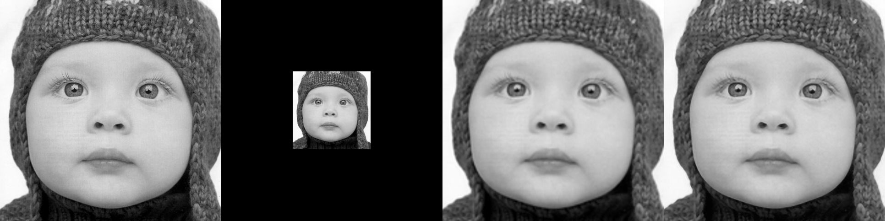
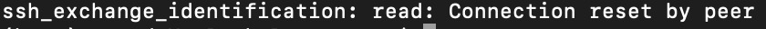
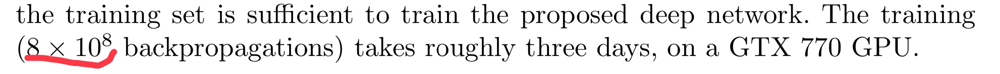
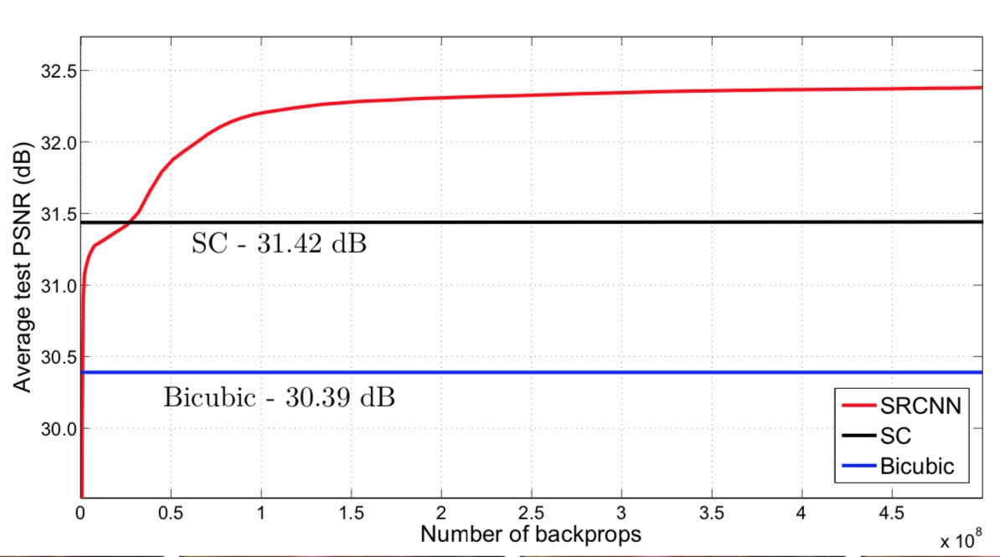

# SR
超分辨率技术（Super-Resolution, SR）

**论文 [Learning a Deep Convolutional Network for Image Super-Resolution](https://arxiv.org/abs/1501.00092)的keras复现**

注：因为自己的windows和实验室的台式机都在学校，同时实验室的服务器由于很多学长学姐在使用，远程账号连接不稳定，所以刚开始是在自己的mac上用keras实现，CPU运行。

#### 结果：                

20个epoch，scale=3，训练曲线如下

测试结果：从左到右，图1groudtruth，图2低分辨率图片(1/3)，图3双三次插值结果，图4复现SRCNN结果

| Set-5 scale=3 | paper-bicubic | aper-SRCNN | self-bicubic | self-SRCNN |
| ------------- | ------------- | ---------- | ------------ | ---------- |
| baby          | 33.91         | 35.01      | 32.541       | 33.626     |
| birds         | 32.58         | 34.91      | 31.320       | 33.231     |
| butterfly     | 24.04         | 27.58      | 22.741       | 25.772     |
| head          | 32.88         | 33.55      | 31.530       | 32.255     |
| woman         | 28.56         | 30.92      | 27.321       | 29.292     |
| average       | 30.39         | 32.39      | 29.090       | 30.835     |

虽然因为训练的epoch太少，没有达到老师的要求：不能低0.01分贝，后面服务器连上了再继续训练，但是可以看到双三次插值的psnr值也没有论文高，可能是matlab和python实现的不同，所以从相对双三次插值的提升率来看paper:(32.39-30.39)/30.39=6.5%，复现:(30.835-29.090)/29.090=6.0%

#### 实现过程的问题：

1.loss下降的不快，但是准确率一直稳定在0.1，检查了train和label确实是对应上的，batchsize调小影响也不大，去掉了输入图片/255的归一化，归一化之后，loss太小了，loss已经1e-3, acc才1e-4；虽然准确率一直在0.1抖动，但是简单的查看了一下模型效果也还行，butterfly的PSNR为23.7；acc还是一直上不去，因为之前我一直训练的epoch比较短，epoch=6左右，简单的看一下loss和acc的情况，因为网络非常简单，需要拟合的参数很少，我觉得几个epoch应该就够了；实在不知道网络的问题在哪，应该是数据量比较大21884，几个epoch网络学不到数据的特征，所以移到了服务器上，跑了200个epoch，结果还是一样的问题，acc在0.1左右抖动；

2.从头到尾仔细检查了几遍代码和模型，突然发现可能是keras评估函数的acc的问题，想取200epoch中最好的model试一下PSNR，结果服务器连不上了；直接把**训练过程的评估函数metrics从acc换成了PSNR**，终于解决了，在自己电脑上跑了几轮，PSNR一直上升到30左右，但是有待提升，等候服务器连接正常；

服务器一直连接过多：

3.预测过程：图片YCrCb空间的问题，图像还原不了RGB；Y是指亮度(luma)分量(灰阶值)，Cb指蓝色色度分量，而Cr指红色色度分量；训练只用了Y，当然还原不出来，刚开始没弄清楚这个YCrCb，要想RGB图片，只需要调整一下网络的channel=3，同时对应调整一下train和label就行了；

4.PSNR的计算结果有问题，可能的原因：因为测试的时候，是拼接来完成的，所以图像的周围像素点可能计算不对；PSNR的计算函数有问题(排除，tf中可以直接调用)；最终发现果然是周围像素计算的错误，预测结果有黑边；然后我也换了一种预测方法，写一个预测用的网络，载入训练好的参数，就可以输入任意尺寸无需拼接结果。

5.服务器宕机了；尝试利用谷歌Colaboratory，可是翻墙太慢，数据上传了一晚上都没上传完，也尝试了上传再解压，同样的问题，4w多的文件非常慢；自己电脑跑起来太烫了，不敢跑太多的epoch；

6.最后在自己电脑上跑了20个epoch，因为网络比较简单，也没必要再死磕了，不过**结果没达到老师的要求，跑的轮数太少了，训练曲线也能看出，PSNR还在上升，后面等服务器好了再继续**。原文跑了非常多的epoch，效果也更好：

